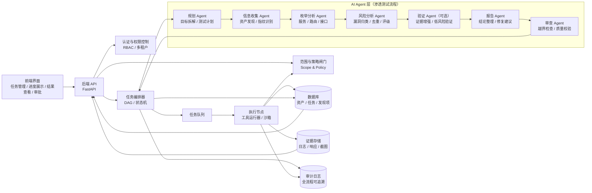

# SafeSurface.ai 基于大模型的安全攻防智能体系统

```mermaid
flowchart LR
    %% 前端
    UI[前端界面<br/>任务管理 / 进度展示 / 结果查看 / 审批]

    %% 控制面
    API[后端 API<br/>FastAPI]
    Auth[认证与权限控制<br/>RBAC / 多租户]
    Policy[范围与策略闸门<br/>Scope & Policy]
    Orchestrator[任务编排器<br/>DAG / 状态机]

    %% Agent 层（渗透测试流程）
    subgraph Agents[AI Agent 层（渗透测试流程）]
        Planner[规划 Agent<br/>目标拆解 / 测试计划]
        Recon[信息收集 Agent<br/>资产发现 / 指纹识别]
        Enum[枚举分析 Agent<br/>服务 / 路由 / 接口]
        Vuln[风险分析 Agent<br/>漏洞归类 / 去重 / 评级]
        Verify[验证 Agent（可选）<br/>证据增强 / 低风险验证]
        Report[报告 Agent<br/>结论整理 / 修复建议]
        Critic[审查 Agent<br/>越界检查 / 质量校验]
    end

    %% 数据面
    Queue[任务队列]
    Worker[执行节点<br/>工具运行器 / 沙箱]

    %% 存储
    DB[(数据库<br/>资产 / 任务 / 发现项)]
    Evidence[(证据存储<br/>日志 / 响应 / 截图)]
    Audit[(审计日志<br/>全流程可追溯)]

    %% 前端交互
    UI --> API
    API --> Auth
    API --> Policy
    API --> Orchestrator

    %% 编排与 Agent
    Orchestrator --> Planner
    Planner --> Recon
    Recon --> Enum
    Enum --> Vuln
    Vuln --> Verify
    Verify --> Report
    Report --> Critic
    Critic --> Orchestrator

    %% 执行流程
    Orchestrator --> Queue
    Queue --> Worker
    Worker --> Policy

    %% 数据与证据
    Worker --> DB
    Worker --> Evidence
    Orchestrator --> DB

    %% 审计
    Orchestrator --> Audit
    Worker --> Audit

    %% 查询回流
    DB --> API
    Evidence --> API

```